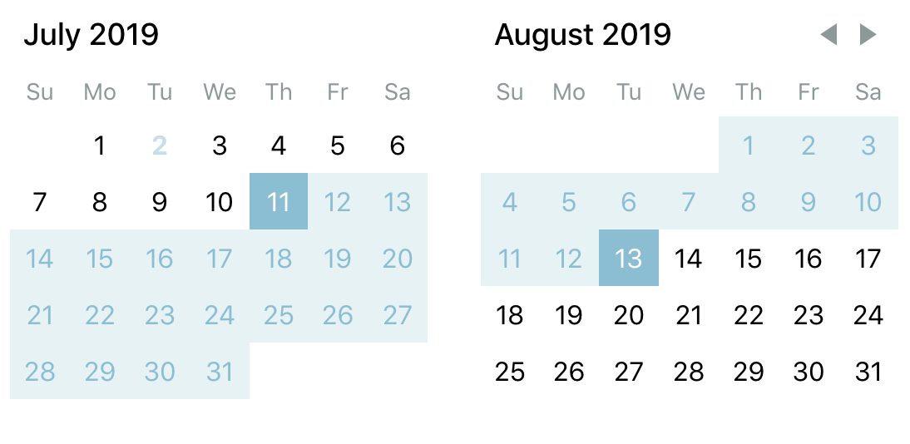
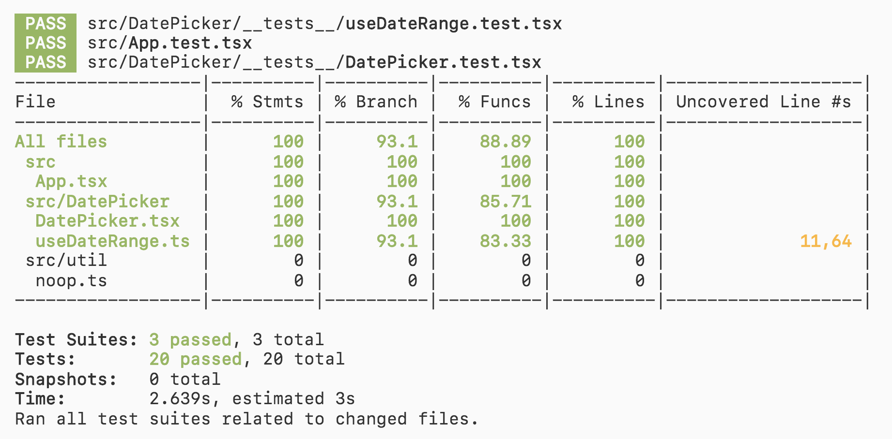

# date-hooks-test
`react-day-picker` usage, implemented with hooks; contains unit and integration tests!




## Getting started
```sh
# install dependencies
$ yarn install

# run tests in interactive mode
$ yarn test 

# run tests and generate code coverage
# open coverage/lcov-report/index.html in your browser
$ yarn test --coverage

# run the development server on localhost:3000
$ yarn start
```